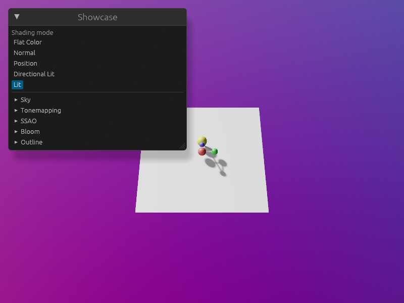
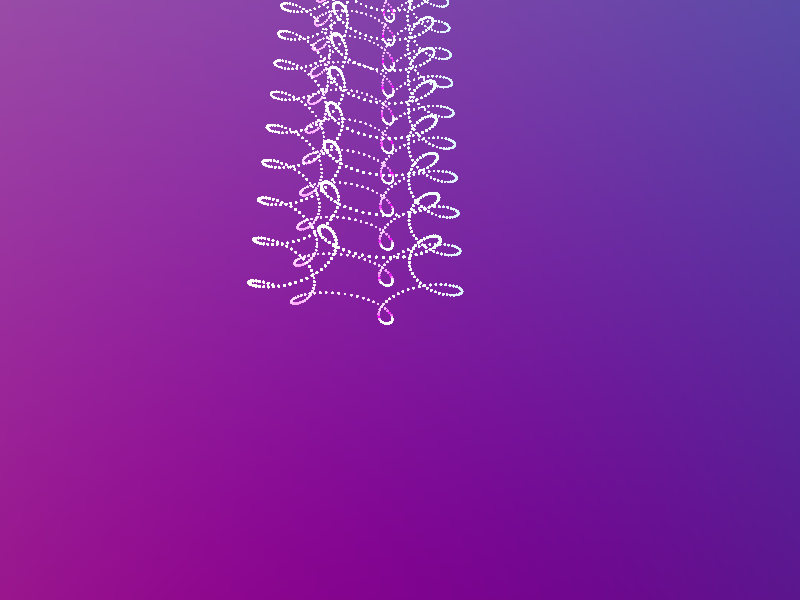
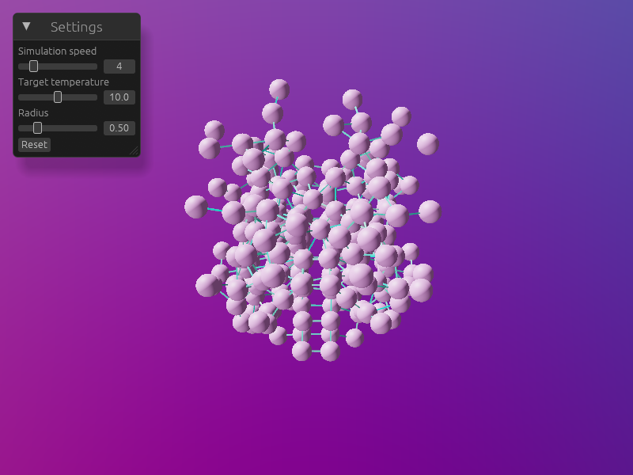

# Visula

Turn data streams from simulations and recordings into interactive 3D visualizations you can share on the web.

Visula is a scientific visualization library built on [wgpu](https://wgpu.rs). It targets the browser via WebGPU/WebGL first and runs natively for performance. Same API in Rust and Python.

> Visula is built around my own visualization needs and is shared in case it's useful to others. It's a work in progress — APIs may change.



## The idea

High-level primitives, low-level control. You start with spheres, lines, or meshes, and shape them with expressions that run on the GPU.

If you want to add whiskers to each point, draw normals on top of a point cloud, or color particles by a field you compute on the fly — those aren't features Visula has to ship. They're things you express on top of what's already there, using the same primitives and expressions.

```python
from visula import SphereDelegate, Figure, InstanceBuffer
import visula as vl
import numpy as np

t = InstanceBuffer(np.linspace(0, 100, 100_000))
position = 10.0 * vl.vec3(vl.cos(t), vl.sin(t), t)

spheres = SphereDelegate(
    position=position,
    radius=0.2,
    color=position / 4.0,
)

Figure().show([spheres])
```

`position` is not a NumPy array — it's an expression. Visula compiles it into the shader and evaluates it per instance on the GPU. A million spheres cost the same to upload as one.



## The same in Rust

```rust
use visula::{Expression, InstanceDeviceExt, SphereGeometry, SphereMaterial, Spheres};
use visula_derive::Instance;

#[repr(C, align(16))]
#[derive(Clone, Copy, Instance, bytemuck::Pod, bytemuck::Zeroable)]
struct Particle {
    position: glam::Vec3,
    _padding: f32,
}

let buffer = application.device.create_instance_buffer::<Particle>();
let particle = buffer.instance();

let spheres = Spheres::new(
    &application.rendering_descriptor(),
    &SphereGeometry {
        position: particle.position,
        radius: 0.5.into(),
        color: Expression::Position * 0.1 + 0.5,
    },
    &SphereMaterial { color: Expression::InputColor.lit() },
)?;
```



## Run the examples

```bash
# Native Rust
cargo run --example showcase
cargo run --example molecular_dynamics
cargo run --example neuron

# Python
./run-python.sh visula_pyo3/examples/simple.py
./run-python.sh visula_pyo3/examples/controls.py

# Web (WebGPU/WebGL)
./run-wasm.sh
```

See `visula/examples/` and `visula_pyo3/examples/` for the full set.

## License

Apache-2.0. See [LICENSE](LICENSE).
