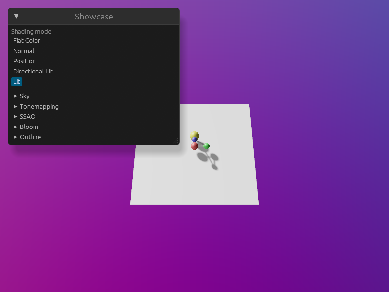
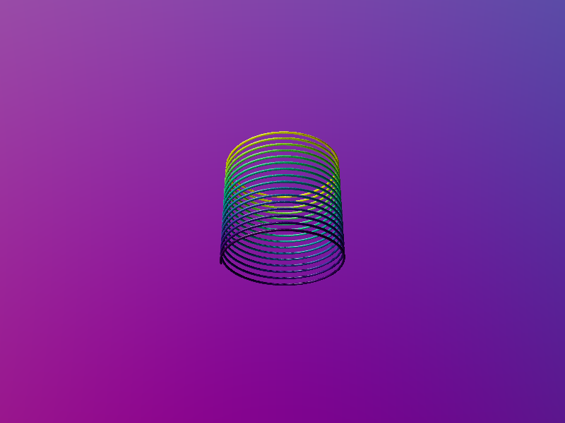
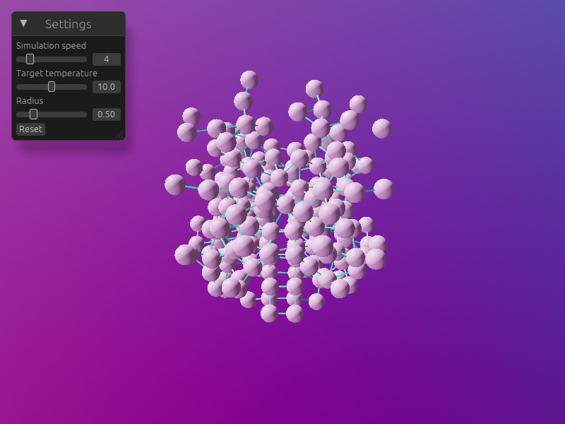

# Visula

Turn data streams from simulations and recordings into interactive 3D visualizations you can share on the web.

Visula is a scientific visualization library built on [wgpu](https://wgpu.rs).
Applications can run natively in Linux, Windows or macOS, or target the web with WASM and WebGPU.

Visula is built around my own visualization needs and is shared in case it's useful to others. It's a work in progress — APIs may change.



## Python example

The idea behind Visula is to make it easy to create data-driven visualizations.
Primitives like spheres, lines or triangle meshes can be defined directly from data.
This includes their position and color.

InstanceBuffers can be used to define multiple instances of a given primitive:


```python
from visula import Spheres, Figure, InstanceBuffer
import visula as vl
import numpy as np

t = InstanceBuffer(np.linspace(0, 100, 100_000))
position = 10.0 * vl.vec3(vl.cos(t), vl.sin(t), t / 50.0 - 1.0)

spheres = Spheres(
    position=position,
    radius=0.2,
    color=vl.colormap(t / 100.0, "viridis"),
)

Figure().show([spheres])
```

Here, `position`, `radius` and `color` are all expressions.
Visula compiles these into the shader and evaluates them per instance on the GPU.
This means that there is only one array `t` uploaded to the GPU.
The `colormap` function maps a value in [0, 1] to a color — `viridis`, `plasma`, `magma` and `inferno` are available — and it too runs in the shader.



## Rust example

The same visualization in Rust:

```rust
use visula::{colormap, vec3, Colormap, SphereGeometry, SphereMaterial, Spheres};

fn main() {
    visula::run(|application| {
        let data: Vec<f32> = (0..100_000).map(|i| i as f32 * 0.001).collect();
        let t = application.instances(&data);
        let position = 10.0 * vec3(t.cos(), t.sin(), &t / 50.0 - 1.0);
        Spheres::new(
            &application.rendering_descriptor(),
            &SphereGeometry {
                position,
                radius: 0.2.into(),
                color: colormap(&t / 100.0, Colormap::Viridis),
            },
            &SphereMaterial::default(),
        )
        .unwrap()
    });
}
```

This is [visula/examples/spheres.rs](visula/examples/spheres.rs).
For structured per-instance data, derive `Instance` on a struct and each field becomes an expression; see [visula/examples/molecular_dynamics.rs](visula/examples/molecular_dynamics.rs).
For simulations that update every frame, implement the `Simulation` trait instead of returning renderables; see [visula/examples/showcase.rs](visula/examples/showcase.rs).



## Run the examples

```bash
# Native Rust
cargo run --example spheres
cargo run --example showcase
cargo run --example molecular_dynamics
cargo run --example neuron

# Python (uv sync builds the Rust extension on first run)
uv run visula_pyo3/examples/simple.py
uv run visula_pyo3/examples/controls.py

# Web (WebGPU/WebGL)
./run-wasm.sh
```

See `visula/examples/` and `visula_pyo3/examples/` for the full set.

## License

Apache-2.0. See [LICENSE](LICENSE).
